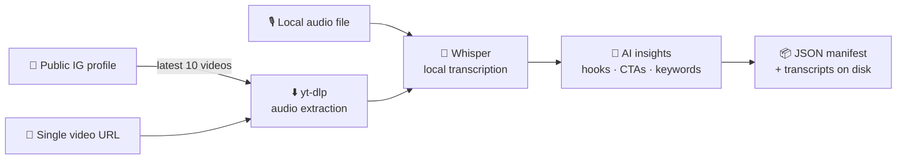

<div align="center">

# 📸 IG Content Transcriber

### Turn any public Instagram profile into a searchable content-strategy playbook.

**Free · Open source · Runs 100% on your machine**

[](https://www.python.org/)
[](https://github.com/openai/whisper)
[](https://modelcontextprotocol.io/)
[](#)
[](#)

*Your competitors publish their content strategy every single day — in their Reels.*
*This tool transcribes it, mines it, and hands you their hooks, CTAs, and script patterns on a plate.*

[🚀 Quick Start](#-quick-start) · [🔍 Use Cases](#-built-for-competitive-content-research) · [🖥️ Web UI](#️-the-dashboard) · [🤖 AI Agents](#-plug-it-into-claude-or-any-ai-agent-mcp) · [🎛️ Tuning](#️-tuning)


</div>

---

## 🎯 Why this exists

Watching competitor Reels one by one and taking notes is slow, subjective, and impossible to scale. **IG Content Transcriber** automates the research grind:

1. Point it at any **public Instagram profile**.
2. It grabs the **latest 10 videos**, extracts the audio, and transcribes every word with **OpenAI Whisper** — locally, for free.
3. It then generates **AI insights per video and across the whole batch**: hooks, CTAs, sentiment, recurring keywords, title ideas, and repurposing angles.

You end up with clean transcripts + structured JSON you can search, diff, feed to an LLM, or drop into a spreadsheet. No subscriptions, no per-minute transcription fees, no data leaving your machine (Whisper runs locally; AI insights optionally use your own free GroqCloud key and fall back to built-in heuristics without one).

## ✨ What you get

| | Feature | Details |
|---|---|---|
| 🎬 | **Profile batch mode** | Latest 10 videos from any public IG profile in one command |
| 🔗 | **Single video mode** | Any Reel/post URL — or any video URL yt-dlp supports |
| 🎙️ | **Local audio mode** | Drop in an `mp3`/`wav`/`m4a`/… and skip Instagram entirely |
| 📝 | **Word-for-word transcripts** | Whisper `tiny` → `large-v3`, auto language detection |
| 🧠 | **Per-video AI insights** | Hook, summary, CTA, sentiment, keywords, title suggestions, content angles |
| 📊 | **Batch AI overview** | Recurring themes, top hooks, and CTA patterns across all 10 videos |
| 🖥️ | **Web dashboard** | Live progress, history, transcript viewer — built with React + shadcn/ui |
| 🤖 | **MCP server** | Claude, Cursor, or any MCP agent can drive the whole pipeline |
| 💾 | **Everything saved** | Audio, transcripts, metadata, and manifests organized per creator |

## 🔍 Built for competitive content research

Once transcripts + insights land on disk, the analysis writes itself:

- **🪝 Hook mining** — the first line of all 10 recent videos, side by side. See exactly how a competitor opens.
- **📣 CTA patterns** — every "follow / comment / link in bio / DM me" detected and counted across the batch.
- **🧬 Script structure** — full transcripts reveal pacing: hook → context → payoff → CTA. Steal the skeleton, not the words.
- **🔑 Topic clusters** — recurring keywords across a creator's last 10 videos = their actual content pillars.
- **📈 Trend triangulation** — run 3–5 competitors through the tool and diff what they're all suddenly talking about.
- **♻️ Repurposing angles** — each video's insights include ready-to-use content angles and title ideas for your own spin.

> **Fair use, please:** this tool works with **public profiles only**, and it's built for research and inspiration — study patterns, don't plagiarize scripts. Instagram may rate-limit anonymous requests; be a good citizen.

## ⚙️ How it works



## 🚀 Quick Start

**Requirements:** Python 3.11+, `ffmpeg` on your PATH, network access.

```bash
git clone https://github.com/4nw3rprod/IG-Content-Transcriber.git
cd IG-Content-Transcriber
python3.11 -m venv .venv
.venv/bin/pip install -r requirements.txt
```

Optional (for Groq-powered AI insights instead of the built-in heuristics):

```bash
cp .env.example .env.local   # then set GROQ_API_KEY
```

**Transcribe a competitor's latest 10 videos:**

```bash
./run_latest_reel_transcription.sh "https://www.instagram.com/nike/" --json
```

**Transcribe a single Reel:**

```bash
./run_latest_reel_transcription.sh "https://www.instagram.com/reel/<id>/" --json --model small --language en
```

That's it. Transcripts, metadata, and the batch manifest land in `outputs/`.

## 📦 What comes out

Each run writes a tidy, per-creator folder tree:

```text
outputs/
└── instagram_profiles/
    └── nike/
        ├── manifest.json          ← batch result + AI overview
        └── <video_id>/
            ├── audio.mp3
            ├── transcript.txt     ← the gold
            └── metadata.json      ← caption, timestamps, insights
```

And with `--json`, stdout is a single machine-readable object:

```jsonc
{
  "status": "ok",
  "input_kind": "instagram_profile",
  "total_videos": 10,
  "completed_videos": 10,
  "videos": [
    {
      "title": "You don't need motivation…",
      "transcript_text": "...",
      "ai_insights": {
        "hook": "You don't need motivation, you need a system.",
        "cta": "follow",
        "sentiment": "positive",
        "keywords": ["system", "habits", "training"],
        "title_suggestions": ["..."],
        "content_angles": ["..."]
      }
    }
  ],
  "ai_overview": {
    "recurring_keywords": ["..."],
    "top_hooks": ["..."],
    "cta_patterns": [["follow", 6], ["link in bio", 3]]
  },
  "manifest_file": "outputs/instagram_profiles/nike/manifest.json"
}
```

On failure the command exits non-zero and (with `--json`) prints `{"status":"error","error":"..."}`, with details on stderr — easy to script around.

## 🖥️ The Dashboard

Prefer clicking to typing?

```bash
./run_ui.sh
```

The launcher builds the frontend, picks an open localhost port, and opens your browser. From the dashboard you can:

- paste a profile/Reel URL **or upload audio** (`mp3`, `wav`, `m4a`, `aac`, `flac`, `ogg`, `webm`)
- pick the Whisper model and an optional language hint
- watch **live progress** through every pipeline stage
- browse job history and open any transcript, insight set, or manifest

## 🤖 Plug it into Claude (or any AI agent) — MCP

This repo ships a hardened **Model Context Protocol server**, so an AI agent can run your competitor research for you: *"Transcribe @competitor's latest Reels and summarize their hook formulas."*

```json
{
  "mcpServers": {
    "ig-transcriber": {
      "command": "/absolute/path/to/IG-Content-Transcriber/run_mcp_server.sh"
    }
  }
}
```

Prefer HTTP? `./run_mcp_server.sh --transport streamable-http --host 127.0.0.1 --port 8001` → connect to `http://127.0.0.1:8001/mcp`.

**Tools exposed:**

| Tool | What it does |
|---|---|
| `transcribe_input` | Profile URL → latest 10 videos, or any single video URL |
| `transcribe_local_audio` | Transcribe a local audio file + insights |
| `list_recent_batches` | Browse saved runs |
| `read_batch_manifest` | Load a full batch result |
| `read_video_output` | Load one video's transcript + metadata |
| `check_health` | Self-diagnose ffmpeg/Whisper/yt-dlp, disk, and job status |

Plus resources: `ig-transcriber://server`, `ig-transcriber://recent-batches`, `ig-transcriber://manifest/{group}/{label}`, and `ig-transcriber://transcript/{group}/{label}/{video_id}`.

**Built agent-tough:** tools never throw for expected failures — every call returns `status: "ok"` or a structured error (`error_type` + message + `hint`) an agent can recover from. Progress streams as MCP notifications, jobs are queued with hard timeouts, corrupt files degrade gracefully, and `include_transcript_text=false` / `max_transcript_chars` keep responses context-window-friendly (full text always stays on disk).

## 🎛️ Tuning

All optional, via environment variables:

| Variable | Default | Purpose |
|---|---|---|
| `GROQ_API_KEY` | — | Enables GroqCloud AI insights (heuristic fallback otherwise) |
| `IG_TRANSCRIBER_OUTPUT_DIR` | `<repo>/outputs` | Where results are written |
| `IG_TRANSCRIBER_JOB_TIMEOUT_SECONDS` | `3600` | Hard per-job timeout (MCP) |
| `IG_TRANSCRIBER_QUEUE_TIMEOUT_SECONDS` | `900` | Max wait for a job slot (MCP) |
| `IG_TRANSCRIBER_MAX_CONCURRENT_JOBS` | `1` | Parallel transcription jobs (MCP) |
| `IG_TRANSCRIBER_MAX_UPLOAD_BYTES` | 2 GiB | Max local audio file size (MCP) |
| `IG_TRANSCRIBER_EXTRA_MODELS` | — | Comma-separated extra Whisper model names to allow |
| `IG_TRANSCRIBER_HTTP_TIMEOUT_SECONDS` | `30` | Instagram/Groq/yt-dlp socket timeout |
| `IG_TRANSCRIBER_FETCH_RETRIES` | `3` | Instagram profile fetch attempts (with backoff) |

**Model cheat sheet:** `tiny` = fastest, `base` = default sweet spot, `small`/`medium` = better accuracy, `large-v3` = best (needs RAM/time).

## ✅ Tests

The MCP server and pipeline helpers ship with a lightweight suite (no Whisper/torch download needed):

```bash
.venv/bin/pip install pytest
.venv/bin/python -m pytest tests/ -q
```

## 📝 Good to know

- **Public profiles only** — private accounts are detected and refused.
- Instagram may rate-limit anonymous requests; the tool retries with backoff, but if it's blocked, wait and rerun.
- In a 10-video batch, one broken video won't sink the other nine — failures are recorded per video (`failed_videos` in the result).
- Whisper models are cached after first load; already-transcribed videos are reused on reruns.
- Everything runs locally. The only network calls are to Instagram/video hosts, and (optionally) GroqCloud with your key.
- Agent workflows: see [`CLAUDE.md`](CLAUDE.md).

---

<div align="center">

**Found this useful for your content research? ⭐ Star the repo — it's free and it helps others find it.**

*Built with Whisper, yt-dlp, FastAPI, React + shadcn/ui, and the Model Context Protocol.*

</div>
