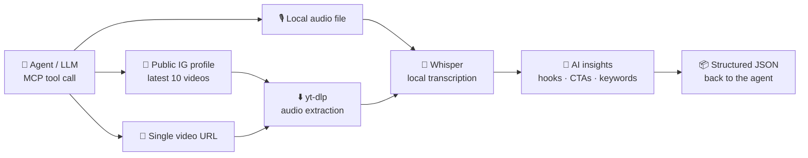

<div align="center">


**Transcribe and decode any public Instagram profile — hooks, CTAs, and script patterns — locally and for free.**

[](https://www.npmjs.com/package/reelrecon)
[](https://www.python.org/)
[](https://github.com/openai/whisper)
[](https://modelcontextprotocol.io/)
[](LICENSE)
[](#)

```bash
npx -y reelrecon
```

*Your agent can already write scripts. Now it can study the competition first:*
*"Transcribe @competitor's latest 10 Reels and break down their hook formulas" — one tool call away.*

[🤖 Agent Setup](#-drop-it-into-your-agent-stack) · [🚀 Quick Start](#-quick-start) · [🔍 Use Cases](#-what-your-agent-can-do-with-it) · [🧰 Tool Reference](#-mcp-tool-reference) · [🖥️ Web UI](#️-the-dashboard-for-humans)


</div>

---

## 🎯 Why this exists

Today, analyzing a competitor's Reels means either paying a per-minute transcription SaaS, or uploading videos one by one to a multimodal model and burning tokens while it watches. **ReelRecon is the third option: free, open source, and local** — an MCP-native pipeline built for the part that actually matters for content strategy, the spoken word:

1. Your agent calls one tool with a **public Instagram profile URL**.
2. The server grabs the **latest 10 videos**, extracts audio, and transcribes every word with **OpenAI Whisper** — locally. No subscriptions, no per-minute fees, no tokens spent on video frames.
3. The agent gets back **structured JSON**: full transcripts plus mined hooks, CTAs, sentiment, keyword clusters, title ideas, and a cross-video strategy overview.

ReelRecon doesn't analyze visuals — scripts, hooks, and CTAs live in the audio, and that's what it mines for patterns and content ideas. It pairs perfectly with video-capable models: triage all ten Reels here for free in minutes, then send only the one or two that matter to a multimodal model for full visual breakdown.

Built agent-tough: structured errors instead of exceptions, progress notifications, job queueing with hard timeouts, context-window-friendly response trimming, and a `check_health` tool so your agent can self-diagnose a broken install instead of hallucinating around it.

## 🤖 Drop it into your agent stack

The server speaks **stdio and streamable-HTTP MCP**, so anything MCP-capable can use it. No MCP? There's a JSON-mode CLI any framework can shell out to.

### ⚡ One command, no clone: `npx`

With Node 18+, Python 3.10+ (3.11 recommended), and `ffmpeg` installed:

```bash
npx -y reelrecon
```

That starts the MCP server on stdio. The first run provisions a private Python environment in `~/.reelrecon` (Whisper + friends — a few minutes and a few GB, once); every start after that is instant. One-off CLI runs work too:

```bash
npx -y reelrecon transcribe "https://www.instagram.com/<username>/" --json
```

> Already have Python + deps? Set `REELRECON_PYTHON=/path/to/python` to skip provisioning and use your own environment.
>
> Package not on npm yet in your region/registry? Run it straight from GitHub — same launcher: `npx -y github:4nw3rprod/ReelRecon`

| Agent / Framework | Integration |
|---|---|
| **Claude Code** (CLI) | `claude mcp add reelrecon -- npx -y reelrecon` |
| **Claude Desktop** | `mcpServers` entry in config |
| **ChatGPT / Codex CLI** | `mcp_servers` entry in `~/.codex/config.toml` |
| **Gemini CLI** | `mcpServers` entry in `~/.gemini/settings.json` |
| **Cursor / Windsurf / Cline** | Standard MCP server config (stdio) |
| **OpenClaw, Hermes & other open agent frameworks** | Point the framework's MCP client at `npx -y reelrecon` (stdio) or the HTTP endpoint |
| **LangChain / CrewAI / custom loops** | Use an MCP adapter, or shell out to the CLI with `--json` |

<details>
<summary><b>Claude Code</b></summary>

```bash
claude mcp add reelrecon -- npx -y reelrecon
```
</details>

<details>
<summary><b>Claude Desktop / Cursor / most MCP clients</b></summary>

```json
{
  "mcpServers": {
    "reelrecon": {
      "command": "npx",
      "args": ["-y", "reelrecon"]
    }
  }
}
```
</details>

<details>
<summary><b>ChatGPT — Codex CLI</b> (<code>~/.codex/config.toml</code>)</summary>

```toml
[mcp_servers.reelrecon]
command = "npx"
args = ["-y", "reelrecon"]
```
</details>

<details>
<summary><b>Gemini CLI</b> (<code>~/.gemini/settings.json</code>)</summary>

```json
{
  "mcpServers": {
    "reelrecon": {
      "command": "npx",
      "args": ["-y", "reelrecon"]
    }
  }
}
```
</details>

<details>
<summary><b>Running from a local clone instead of npx</b></summary>

Clone the repo, install the Python deps ([Quick Start](#-quick-start)), then point your MCP client at the launcher script:

```json
{
  "mcpServers": {
    "reelrecon": {
      "command": "/absolute/path/to/ReelRecon/run_mcp_server.sh"
    }
  }
}
```
</details>

<details>
<summary><b>HTTP transport</b> (for frameworks that prefer a URL — OpenClaw, Hermes, remote setups)</summary>

```bash
./run_mcp_server.sh --transport streamable-http --host 127.0.0.1 --port 8001
```

Then point the client at `http://127.0.0.1:8001/mcp`.
</details>

<details>
<summary><b>No MCP? Shell out to the JSON CLI</b> (LangChain, CrewAI, cron jobs, anything)</summary>

```bash
./run_latest_reel_transcription.sh "https://www.instagram.com/<username>/" --json
```

stdout is a single JSON object on success; non-zero exit + `{"status":"error","error":"..."}` on failure. Trivially parseable from any language.
</details>

**Then just prompt your agent:**

> *"Use reelrecon to transcribe the latest Reels from @competitor. Compare their hooks against my last 5 scripts and tell me what patterns I'm missing."*

## 🔍 What your agent can do with it

Point any LLM at the structured output and competitive content research becomes a conversation:

- **🪝 Hook mining** — the opening line of a competitor's last 10 videos, side by side. Your agent extracts the formula.
- **📣 CTA patterns** — every "follow / comment / link in bio / DM me" detected and counted per batch.
- **🧬 Script structure** — full transcripts expose pacing: hook → context → payoff → CTA. Steal the skeleton, not the words.
- **🔑 Topic clusters** — recurring keywords across recent videos = a creator's actual content pillars.
- **📈 Trend triangulation** — run 3–5 competitors and let the LLM diff what they're all suddenly talking about.
- **♻️ Repurposing engine** — each video ships with ready-made content angles and title suggestions for your own spin.
- **🕵️ Scheduled watching** — pair with your agent's cron/loop feature: "check these 3 profiles every morning and brief me."

> **Fair use, please:** public profiles only (private accounts are detected and refused), and it's built for research and inspiration — study patterns, don't plagiarize scripts. Instagram may rate-limit anonymous requests; be a good citizen.

## ⚙️ How it works



## 🚀 Quick Start

**Fastest path (no clone):** `npx -y reelrecon` — see [agent setup](#-drop-it-into-your-agent-stack) above.

**Manual setup — requirements:** Python 3.11+, `ffmpeg` on your PATH, network access.

```bash
git clone https://github.com/4nw3rprod/ReelRecon.git
cd ReelRecon
python3.11 -m venv .venv
.venv/bin/pip install -r requirements.txt
```

Optional (Groq-powered insights instead of the built-in heuristics):

```bash
cp .env.example .env.local   # then set GROQ_API_KEY
```

Connect your agent ([see configs above](#-drop-it-into-your-agent-stack)), or run it by hand:

```bash
# A competitor's latest 10 videos
./run_latest_reel_transcription.sh "https://www.instagram.com/nike/" --json

# A single Reel, with model + language hints
./run_latest_reel_transcription.sh "https://www.instagram.com/reel/<id>/" --json --model small --language en
```

## 🧰 MCP tool reference

| Tool | What it does |
|---|---|
| `transcribe_input` | Profile URL → latest 10 videos, or any single video URL yt-dlp supports |
| `transcribe_local_audio` | Transcribe a local audio file + generate insights |
| `list_recent_batches` | Browse saved runs |
| `read_batch_manifest` | Load a full batch result |
| `read_video_output` | Load one video's transcript + metadata |
| `check_health` | Self-diagnose ffmpeg/Whisper/yt-dlp, disk, and job status |

Resources: `reelrecon://server` · `reelrecon://recent-batches` · `reelrecon://manifest/{group}/{label}` · `reelrecon://transcript/{group}/{label}/{video_id}`

**The contract your agent can rely on:**

- Tools **never raise** for expected failures — every call returns `status: "ok"` or a structured error: `error_type` (`invalid_input`, `not_found`, `pipeline_error`, `dependency_error`, `server_busy`, `timeout`, …), a message, and a `hint` the agent can act on.
- **Progress streams** as MCP notifications during long batches.
- **Context-window friendly:** `include_transcript_text=false` or `max_transcript_chars=N` trims responses; full transcripts always stay on disk and behind resources.
- **Partial success:** in a 10-video batch, one broken video is recorded (`failed_videos`) instead of sinking the other nine.
- Jobs are **queued with hard timeouts**; limits are env-tunable (below).

## 📦 What comes out

```text
outputs/
└── instagram_profiles/
    └── nike/
        ├── manifest.json          ← batch result + AI overview
        └── <video_id>/
            ├── audio.mp3
            ├── transcript.txt     ← the gold
            └── metadata.json      ← caption, timestamps, insights
```

```jsonc
{
  "status": "ok",
  "input_kind": "instagram_profile",
  "total_videos": 10,
  "completed_videos": 10,
  "videos": [
    {
      "title": "You don't need motivation…",
      "transcript_text": "...",
      "ai_insights": {
        "hook": "You don't need motivation, you need a system.",
        "cta": "follow",
        "sentiment": "positive",
        "keywords": ["system", "habits", "training"],
        "title_suggestions": ["..."],
        "content_angles": ["..."]
      }
    }
  ],
  "ai_overview": {
    "recurring_keywords": ["..."],
    "top_hooks": ["..."],
    "cta_patterns": [["follow", 6], ["link in bio", 3]]
  },
  "manifest_file": "outputs/instagram_profiles/nike/manifest.json"
}
```

## 🖥️ The Dashboard (for humans)

Agents get MCP; you get a live dashboard:

```bash
./run_ui.sh
```

Builds the frontend, picks an open localhost port, opens your browser. Paste a profile/Reel URL **or upload audio** (`mp3`, `wav`, `m4a`, `aac`, `flac`, `ogg`, `webm`), pick the Whisper model, watch live progress through every pipeline stage, and browse transcript + insight history.

## 🎛️ Tuning

All optional, via environment variables:

| Variable | Default | Purpose |
|---|---|---|
| `GROQ_API_KEY` | — | Enables GroqCloud AI insights (heuristic fallback otherwise) |
| `REELRECON_OUTPUT_DIR` | `<repo>/outputs` | Where results are written |
| `REELRECON_JOB_TIMEOUT_SECONDS` | `3600` | Hard per-job timeout (MCP) |
| `REELRECON_QUEUE_TIMEOUT_SECONDS` | `900` | Max wait for a job slot (MCP) |
| `REELRECON_MAX_CONCURRENT_JOBS` | `1` | Parallel transcription jobs (MCP) |
| `REELRECON_MAX_UPLOAD_BYTES` | 2 GiB | Max local audio file size (MCP) |
| `REELRECON_EXTRA_MODELS` | — | Comma-separated extra Whisper model names to allow |
| `REELRECON_HTTP_TIMEOUT_SECONDS` | `30` | Instagram/Groq/yt-dlp socket timeout |
| `REELRECON_FETCH_RETRIES` | `3` | Instagram profile fetch attempts (with backoff) |

> Legacy `IG_TRANSCRIBER_*` variable names are still honored, so existing setups keep working.

**Whisper model cheat sheet:** `tiny` = fastest, `base` = default sweet spot, `small`/`medium` = better accuracy, `large-v3` = best (needs RAM/time).

## ✅ Tests

The MCP server and pipeline helpers ship with a lightweight suite (no Whisper/torch download needed):

```bash
.venv/bin/pip install pytest
.venv/bin/python -m pytest tests/ -q
```

## 📝 Good to know

- **Public profiles only** — private accounts are detected and refused.
- Instagram may rate-limit anonymous requests; the tool retries with backoff, but if it's blocked, wait and rerun.
- Whisper models are cached after first load; already-transcribed videos are reused on reruns.
- Everything runs locally. The only network calls are to Instagram/video hosts, and (optionally) GroqCloud with your key.
- Agent-facing docs live in [`CLAUDE.md`](CLAUDE.md) — most MCP-aware coding agents pick it up automatically.

---

<div align="center">

**Wiring this into your agent? ⭐ Star the repo — it's free and it helps others find it.**

*Built with Whisper, yt-dlp, FastAPI, React + shadcn/ui, and the Model Context Protocol.*

</div>
